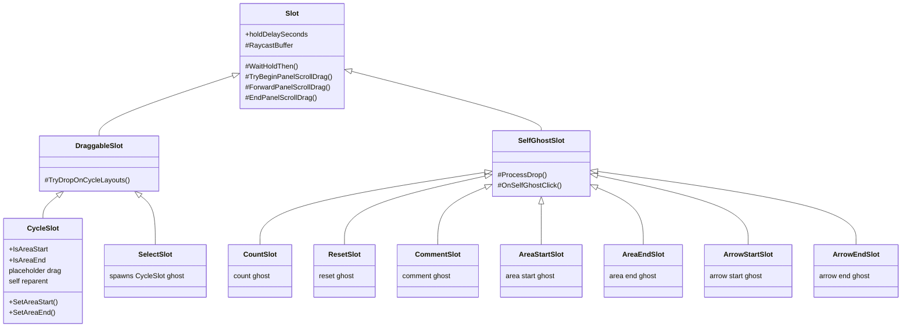

# 🏗️ Technical Architecture Design

## 1. System Architecture Diagram

- **Pattern (목표)**: MonoBehaviour 상속 + Template Method (`OnSlot*`, `ResolveClickOrDragDropPointerUp`) + UGUI EventSystems
- **Pattern (현재)**: `Slot` → `SelfGhostSlot` / `DraggableSlot` 상속 + Template Method
- **Data Flow**:
  - **패널(소스)** → 홀드/드래그 → 고스트(`CycleSlot` 또는 `GameObject`) → 레이캐스트 → **타임라인(싱크)** `CycleHorizontalLayout` / `CyclePanel`
  - **타임라인(거주)** `CycleSlot` → 홀드 시 자기 `RectTransform`을 `forGhostParent`로 이동 → 플레이스홀더로 인덱스 계산 → 드롭 시 레이아웃 재배치



### 역할 분리 (도메인)

| 구분 | 클래스 | 위치 | 책임 |
|------|--------|------|------|
| **타임라인 거주 슬롯** | `CycleSlot` | `UI/Result/Cycle/` | 배치된 스킬 표시, 재정렬, 탭 삭제, 반복 카운트 UI, 영역 지정 데이터 마킹 |
| **패널 → 타임라인 공급** | `SelectSlot` | `UI/Panel/Select/` | 스킬 선택 후 `CycleSlot` 고스트 생성·드롭 |
| **패널 특수 고스트** | `CountSlot`, `ResetSlot`, `CommentSlot`, `AreaStartSlot`, `AreaEndSlot`, `ArrowStartSlot`, `ArrowEndSlot` | `UI/Panel/Special/` | 단순 프리팹 고스트 + `CycleSlot` 태그 대상 조작 |
| **오버레이 가이드라인** | `AreaOverlayPanel`, `AreaHighlightBox`, `ArrowOverlayPanel`, `ArrowRenderer` | `UI/Result/Cycle/` | 시작/끝 지정 슬롯 추적 및 오버레이 브래킷, 구간 배경, 화살표 연결선 렌더링 |
| **미마이그레이션** | `TabSlot`, `BackgroundSlot` | `UI/Grid/`, `UI/Panel/TabMenu/` | 별도 홀드/스크롤 구현 (향후 `Slot` 계열 편입 후보) |

## 2. Key Components & Class Responsibilities

### 현재 구현 (코드 기준 2026-05-23)

- **`Slot.cs`**: 포인터 파사드, `WaitHoldThen`, 패널 스크롤 전달, `RaycastBuffer`, `SetRectTransformToPointer`
- **`SelfGhostSlot.cs`**: `CountSlot`/`ResetSlot`/`CommentSlot`/`AreaStartSlot`/`AreaEndSlot` — 단순 `GameObject` 고스트 파이프라인, `ProcessDrop` / `OnSelfGhostClick`
- **`DraggableSlot.cs`**: `TryDropOnCycleLayouts` — `SelectSlot`/`CycleSlot` 공용
- **`CycleSlot`**: self-reparent, placeholder, 표시·폰트·카운트 UI (2차 `SkillSlotDisplay` 후보), AreaStart/End 마킹
- **`AreaOverlayPanel.cs`**: 영역(Area)의 레이아웃 동기화 통제(Coroutine, ForceRebuildLayoutImmediate, ScrollRect LateUpdate 대기), 다중/불규칙 행 영역 분할 추적, 랜덤 색상(`_savedAreaColors`) 캐싱 및 유지
- **`AreaHighlightBox.cs`**: 영역 데이터 기반 UI 요소(Bracket, Line, Text) 배치 및 색상 깔맞춤 적용

### OOP 검증 요약 (리팩토링 후)

| 원칙 | 평가 | 근거 |
|------|------|------|
| **SRP** | ⚠️ 개선 | 입력·홀드·스크롤은 `Slot`/`SelfGhostSlot`로 이전. `CycleSlot` 표시 UI는 여전히 혼재. |
| **OCP** | ✅ 개선 | 패널 특수 슬롯은 `ProcessDrop`만 override. |
| **LSP** | ✅ | `SelfGhostSlot`/`DraggableSlot` 자식이 부모 포인터 계약 준수 (`CycleSlot` 스크롤 헬퍼 위임 완비). |
| **DRY** | ✅ 개선 | Count≈Reset 통합, 레이아웃 드롭 통합, `RaycastBuffer` 재사용. |

### 상속 구조

```
Slot
├── SelfGhostSlot
│   ├── CountSlot
│   ├── ResetSlot
│   ├── CommentSlot
│   ├── AreaStartSlot
│   ├── AreaEndSlot
│   ├── ArrowStartSlot
│   └── ArrowEndSlot
└── DraggableSlot
    ├── SelectSlot
    └── CycleSlot
```

**2차 추출 및 보완 대상:**

- `SkillSlotDisplay` (Component) — `SelectSlot`과 `CycleSlot`에 중복된 시각적 UI 요소(`chargeBackground`, `icon`, `head`, `nameText`, `countBackground` 등)와 `SetSlot` 로직을 별도 컴포넌트로 분리. 이를 통해 Slot 계열은 '드래그 앤 드롭 및 이벤트 처리'라는 본연의 역할에만 집중(SRP 준수).
- `Slot.holdDelaySeconds` — 컨벤션에 맞춰 직렬화 변수로 수정 (`_` 제거 및 `[SerializeField]` 부착).

## 3. Dependencies & Third-Party Libraries

- Unity UGUI (`ScrollRect`, `LayoutElement`), EventSystems, TextMeshPro
- `UIManager`, `UI_Panel`, `UI_Result`, `CyclePanel`, `CycleHorizontalLayout`
- `ColorEventChannel` (ScriptableObject 이벤트)

## 4. Folder Structure (Directory Layout)

```txt
Assets/Scripts/UI/
├── Panel/
│   ├── Slot.cs                 # 베이스
│   ├── DraggableSlot.cs        # 스크롤 전달 + 사이클 드롭
│   ├── SelfGhostSlot.cs        # Count/Reset 공통 고스트 베이스
│   ├── Select/SelectSlot.cs
│   └── Special/
│       ├── CountSlot.cs
│       ├── ResetSlot.cs
│       ├── CommentSlot.cs      # 주석 슬롯
│       ├── AreaStartSlot.cs    # [신규] 영역 시작 마커 드롭
│       ├── AreaEndSlot.cs      # [신규] 영역 끝 마커 드롭
│       ├── ArrowStartSlot.cs   # [신규] 화살표 시작 마커 드롭
│       ├── ArrowEndSlot.cs     # [신규] 화살표 끝 마커 드롭
│       └── SpecialPanel.cs
├── Result/Cycle/
│   ├── CycleSlot.cs
│   ├── CyclePanel.cs
│   ├── CycleHorizontalLayout.cs
│   ├── CycleVerticalLayout.cs
│   ├── AreaOverlayPanel.cs     # 영역 총괄 (AreaOverlayPanel 컴포넌트)
│   ├── AreaHighlightBox.cs     # 영역 오버레이 렌더러
│   ├── ArrowOverlayPanel.cs    # [신규] 화살표 연결 총괄
│   └── ArrowRenderer.cs        # [신규] 화살표 베지어/직교 곡선 렌더러
├── Grid/BackgroundSlot.cs      # Slot 미편입
└── Panel/TabMenu/TabSlot.cs    # Slot 미편입
```

## 5. 중복 코드 맵 (제거 대상)

| 중복 블록 | 위치 | 통합 방향 |
|-----------|------|-----------|
| 홀드→고스트→PointerUp→Begin/Drag/End | `CountSlot`, `ResetSlot` | `SelfGhostSlot` |
| 동일 + `CycleSlot` 고스트 | `SelectSlot` | `DraggableSlot` + `CreateCycleGhost` 훅 |
| 홀드→reparent→placeholder | `CycleSlot` | `DraggableSlot` + placeholder 전용 protected |
| `WaitForSeconds(_holdTime)` | 4클래스 각각 | `Slot.WaitHoldThen` |
| ScreenPoint→anchoredPosition | 4클래스 | `Slot.SetRectTransformToPointer` static |
| Charge 배경 + 텍스트 | `SelectSlot.SetSlot`, `CycleSlot.SetSlot` | `SkillSlotDisplay` (2차) |
| `new List<RaycastResult>()` | 4클래스 + `TabSlot` | `Slot` protected 재사용 버퍼 |
| `ProcessDrop` CycleLayout/Panel | `SelectSlot`, `CycleSlot` | `DraggableSlot.TryDropOnCycleLayouts` |
